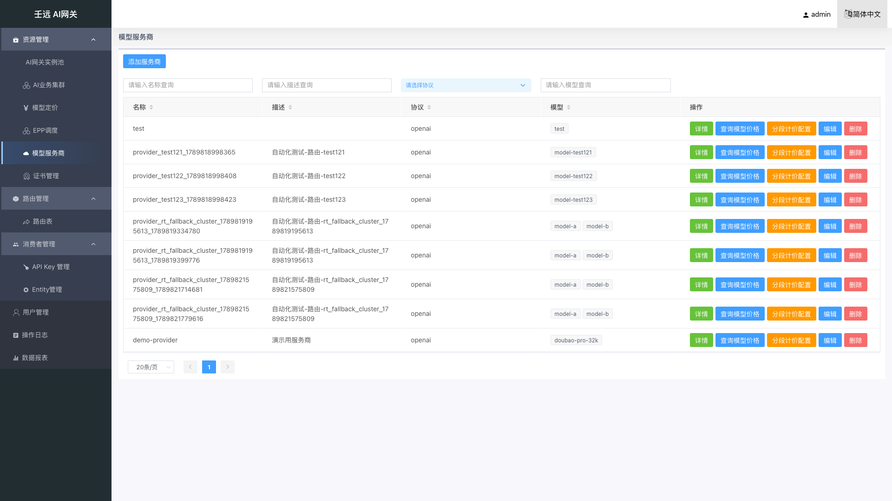
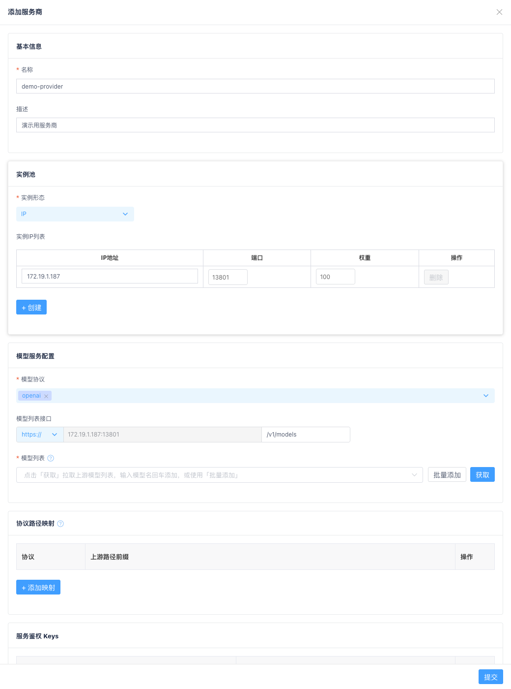
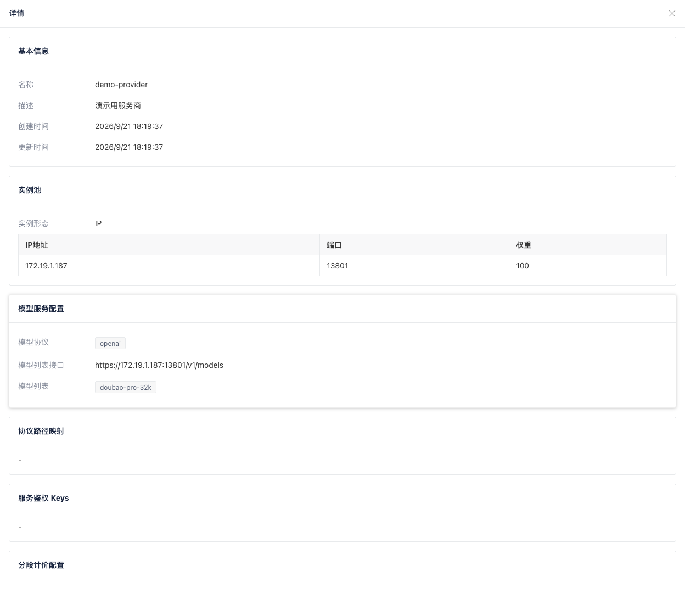
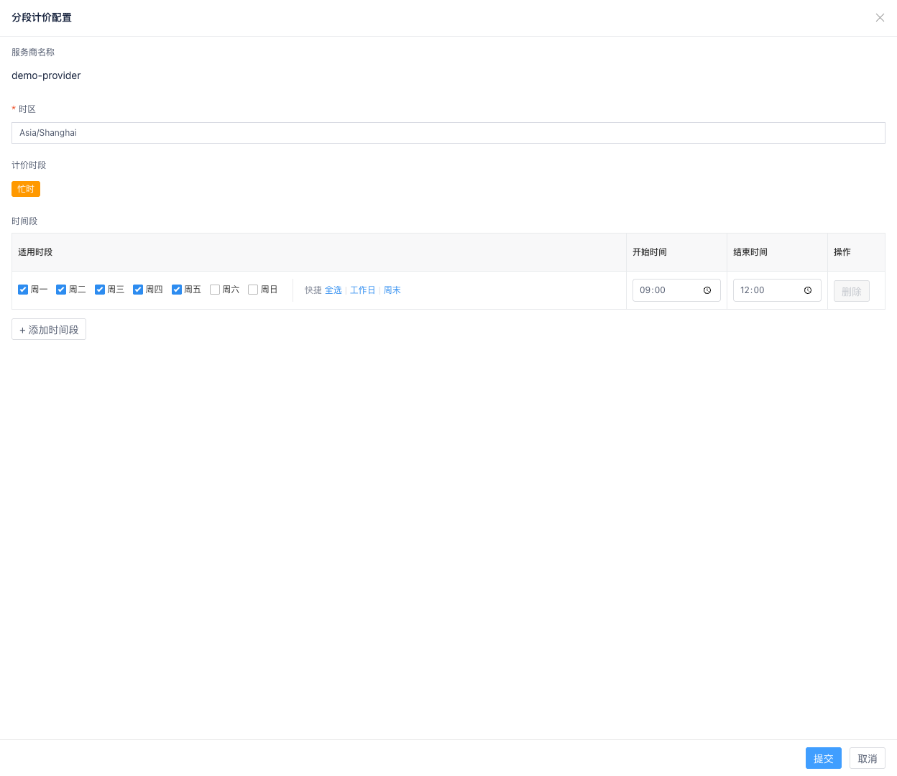

# 03 资源管理：模型服务商

模型服务商是**后端模型服务接入层**的统一抽象：持有实例池（IP 或服务商域名）、模型协议、模型发现端点、服务鉴权 Key 明文与模型列表。业务集群通过「所属服务商」引用服务商，不再在集群向导中重复维护实例地址与 Key 明文。

> **与业务集群的关系**：先创建服务商（定义「连哪里、用什么协议、有哪些模型、Key 是什么」），再创建业务集群（定义「转发策略、超时、健康检查、选用哪些模型与 Key」）。一个服务商可被多个集群引用。

## 首次接入最小配置

| 分区 | 必填项 |
| ------ | ------ |
| 基本信息 | 服务商名称 |
| 实例池 | IP 或服务商域名 + 端口 + 权重（单实例填 100） |
| 模型服务配置 | 模型协议（至少一种）、模型列表接口路径、模型列表（**必填，至少 1 个模型**；点「获取」拉取、输入后回车添加，或「批量添加」粘贴多个名称；**须提交表单才持久化**） |
| 服务鉴权 Keys | 公有云等需鉴权的服务商通常必填 |

## 4.1 服务商列表

进入 资源管理 → 模型服务商，展示当前已创建的服务商列表。

**表格列说明**：

| 列名 | 说明 |
| --- | --- |
| 名称 | 服务商唯一标识，支持按名称搜索和排序 |
| 描述 | 服务商说明 |
| 协议 | 支持的模型访问协议，如 `openai`、`anthropic`；多协议以逗号展示 |
| 模型 | 已配置模型列表；最多展示 2 个 Tag，超出显示 `+N`，悬停 Tooltip 查看完整列表 |
| 操作 | 详情、查询模型价格、分段计价配置、编辑、删除 |

列表上方有「创建服务商」按钮。

**前端筛选**：列表一次拉取全量数据，名称 / 描述 / 协议 / 模型的搜索与排序均在浏览器端完成。

### 查询模型价格

点击「查询模型价格」，跳转到模型定价页并按该服务商名称（`provider` 字段）筛选列表。若无定价记录，提示「未找到提供商 {provider} 的模型定价」。服务商名称须与定价表中的 `provider` 一致，详见 [06 章](06-model-prices.md)。

### 删除服务商

点击「删除」后确认。若该服务商仍被业务集群引用，删除失败并提示「删除失败，该服务商可能仍被集群引用」。需先在相关集群中更换「所属服务商」或删除集群后再删。

## 4.2 创建 / 编辑服务商

点击「创建服务商」或操作列「编辑」，右侧弹出抽屉表单，分为以下 Card 分区：

1. 基本信息
2. 实例池
3. 模型服务配置（模型协议、模型列表接口、模型列表）
4. 协议路径映射
5. 服务鉴权 Keys

编辑时名称字段灰色禁用；密钥留空表示保持原值不变。

## 4.3 基本信息

| 字段 | 必填 | 校验规则 | 说明 |
| --- | --- | --- | --- |
| 名称 | 是 | 1-64 字符；仅允许字母、数字、点(`.`)、下划线(`_`)、中划线(`-`)；不能以点、下划线、中划线开头或结尾；不能包含空白字符；创建时不能与已有服务商重名 | 唯一标识，创建后不可修改 |
| 描述 | 否 | 不超过 256 字符；不能包含控制字符 | 描述用途 |

## 4.4 实例池

与旧版集群向导中的「实例配置」相同，支持 **IP 模式** 与 **服务商域名模式** 二选一。

### IP 模式（默认）

自建机房 / 私有化部署（vLLM / Xinference / Ollama 等）。可「+ 创建」多行实例。

| 字段 | 必填 | 默认值 | 校验规则 | 说明 |
| --- | --- | --- | --- | --- |
| IP 地址 | 是 | 空 | 合法 IPv4 / IPv6；实例间 IP 不能重复 | 后端实例地址 |
| 端口 | 是 | `80` | 1-65535 | 服务端口 |
| 权重 | 是 | 首行 `100`，新增行 `0` | 0-100；所有实例权重之和须等于 100 | 流量分配权重 |

### 服务商域名模式

对接公有云模型服务商。只填一个域名（如 `api.deepseek.com`），端口随协议默认（https→443，http→80），权重固定 100。不支持多地址，不能与 IP 模式混用。

| 字段 | 必填 | 说明 |
| --- | --- | --- |
| 服务商域名 | 是 | 如 `api.deepseek.com` |

## 4.5 模型服务配置

| 字段 | 必填 | 默认值 | 说明 |
| --- | --- | --- | --- |
| 模型协议 | 是 | 空 | 多选；支持 `openai`（OpenAI 兼容）、`anthropic`（Claude Messages API）、`gemini`（Google Gemini API）；至少选一种 |
| 模型列表接口 | 否 | `https://{实例地址}/v1/models`（`gemini` 协议默认 `/v1beta/models`） | 由协议 + 实例地址（只读，来自实例池）+ URI 路径组成；路径须以 `/` 开头，默认 `/v1/models`（`gemini` 为 `/v1beta/models`） |
| 模型列表 | 是 | 空 | 标签多选，至少 1 个模型；可「获取」拉取、输入后回车添加或「批量添加」粘贴，详见下方「模型列表」 |

> 系统根据所选「模型协议」自动决定调用模型发现接口时的认证头风格（如 `openai` 使用 `Authorization: Bearer`，`anthropic` 使用 `x-api-key`，`gemini` 使用 `x-goog-api-key`）。**不再支持**在模型列表接口中自定义 `Authorization` Header。

### 模型列表

模型列表为**必填项（至少 1 个模型）**，标签左侧有红色必填星号 `*`。可通过「获取」从上游拉取、在下拉框中输入模型名后按回车添加，或点击「批量添加」一次粘贴多个模型名。

**校验规则**：

- 至少 1 个模型：提交时若列表为空，提示「模型列表为必填项，请至少添加 1 个模型」
- 元素非空：模型名不能为空字符串
- 元素不可重复：同一服务商内模型名不能重复

| 操作 | 说明 |
| --- | --- |
| 「获取」 | 调用 `POST /providers/tools/discover-models` 无状态发现接口，用当前表单的协议、实例池、模型列表路径与首个 Key 拉取上游模型并**覆盖**回填到下拉框 |
| 「批量添加」 | 打开文本框，按行或用逗号 / 中文逗号 / 分号 / 空白分隔粘贴多个模型名；确认后**合并**进现有列表（去重、跳过已有项），不覆盖 |
| 下拉框粘贴 | 若剪贴板文本可拆出 2 个及以上模型名，会自动拆成多个 Tag；单个名称仍按回车添加 |
| 置灰条件 | 未选择模型协议，或实例池无有效地址时「获取」按钮禁用 |
| 提交 | 「获取」或「批量添加」成功后**不会**自动保存，须点击抽屉底部「提交」才写入服务商资源 |

> **常见坑**：点「获取」无反应或失败，先检查实例地址、端口、协议与 Key 是否正确，以及 BFE / API Server 能否访问该后端。

## 4.6 协议路径映射

当一个服务商支持多种模型协议（如同时勾选 `openai` 与 `anthropic`），且各协议的**上游 API 基路径**不同时，可通过 `protocol_paths` 为每种协议分别指定基路径。

配置值即该协议官方 SDK `base_url` 的 path 部分：`openai` 含 `/v1` 尾（OpenAI SDK 会向 base_url 拼接 `/chat/completions` 等），`anthropic` 不含 `/v1`（Anthropic SDK 自行拼接 `/v1/messages`）。

| 字段 | 必填 | 默认值 | 校验规则 | 说明 |
| --- | --- | --- | --- | --- |
| 协议 | 是 | — | 须在已选的 `模型协议` 范围内 | 下拉选择，选项来自当前表单已勾选的模型协议 |
| 路径 | 是 | 协议默认路径 | 以 `/` 开头，不以 `/` 结尾；不含 `?` `$` `#` `..` | 上游 API 基路径，如 `/v1`、`/api/openai` |

**表格操作**：

| 操作 | 说明 |
| --- | --- |
| 「+ 添加映射」 | 在表格中新增一行：协议下拉框 + 路径输入框 + 删除按钮 |
| 「删除」 | 移除该行映射；清空全部映射后保存，将显式提交空对象以禁用路径改写 |

**改写规则**：

- `anthropic`：请求 `/v1/messages`（及其子路径）改写为 `{anthropic}/v1/messages`。
- `openai`：请求命中标准端点（`/chat/completions`、`/completions`、`/embeddings`、`/models`、`/responses` 等）时，先剥离可选的 `/v1` 前缀再拼接到基路径——`/v1/chat/completions` 与 `/chat/completions` 均改写为 `{openai}/chat/completions`。即客户端入口带不带 `/v1` 都不影响最终上游路径，兼容 Trae 等直连 `base_url` 的 OpenAI 兼容客户端。
- 未配置（或对应协议无条目）时请求路径**原样转发**；未命中 openai 标准端点的路径（服务商原生路径、自定义路径、`/v10/xxx`、`/v1beta/...`）永不改写，客户端以服务商原生路径访问的透传模式不受影响。
- `gemini` 不支持路径改写（其原生路径即标准路径，透传已可用）。

> **使用场景**：例如 deepseek 同时支持 `openai` 与 `anthropic` 协议，可分别配置 `{"openai": "/v1", "anthropic": "/anthropic"}`。未配置映射的协议按上述「改写规则」走默认行为。

## 4.7 服务鉴权 Keys

当后端模型服务需要鉴权时配置。Key 明文仅保存在服务商资源中，业务集群通过 Key **名称**引用。

| 字段 | 必填 | 校验规则 | 说明 |
| --- | --- | --- | --- |
| Key 名称 | 条件必填 | 1-128 字符；同一服务商内不能重复 | 行内任一字段填写后本行必填；供集群侧下拉选择 |
| Key 值 | 条件必填 | 1-512 字符 | 实际 API Key；编辑时留空表示不修改 |

- 支持「+ 添加 Key」增加行、「删除」移除行。
- 空行不参与校验，提交时自动过滤。
- 编辑模式下已配置的 Key 会提示「已配置 Key，如需修改请输入新 Key；留空则保持不变」。

## 4.8 查看详情

点击「详情」打开只读抽屉，展示基本信息（含创建时间、更新时间）、实例池、模型服务配置（模型协议、模型列表接口、模型列表）、协议路径映射、服务鉴权 Keys（Key 值脱敏），以及分段计价配置摘要（时区、忙时时间段表；未配置时显示「未配置」）。

## 4.9 分段计价配置

点击列表操作列「分段计价配置」，打开独立抽屉，用于配置该服务商的**忙时（peak）**时间段，供模型定价中的分时段价格匹配使用。

| 字段 | 必填 | 说明 |
| --- | --- | --- |
| 服务商名称 | — | 只读 |
| 时区 | 是 | IANA 时区名，如 `Asia/Shanghai`；须通过合法性校验 |
| 计价时段 | — | 只读展示「忙时」标签；初期仅支持 `peak` |
| 时间段 | 是 | 表格配置适用星期、起止时间；支持快捷「全选 / 工作日 / 周末」；至少保留 1 行；同一 tier 内多段为「或」关系 |

**时间规则**：

- 起止时间格式 `HH:MM`；结束时间须大于开始时间；跨午夜请拆成两段。
- 适用时段为空表示每天；星期取值 0=周日 … 6=周六。
- 同一 tier 内多个时间段按「或」匹配；`start <= 当前时刻 < end`（左闭右开）。

提交后调用 `PUT /providers/{name}/pricing-tiers` 单独保存，不影响服务商其他字段。

## 4.10 注意事项

- 服务商名称创建后不可修改，建议与定价表 `provider` 字段保持一致，便于费用核算与「查询模型价格」跳转。
- 修改实例池或 Keys 会影响所有引用该服务商的集群转发行为，请在低峰期操作。
- 删除前确认无集群引用；`model-prices` 中存在同名 `provider` **不会**阻止删除服务商。
- 模型协议与集群转发路径须匹配：例如仅支持 `openai` 的服务商，不应承载 Anthropic 风格请求。
