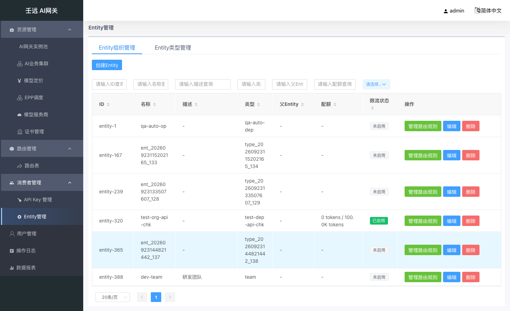
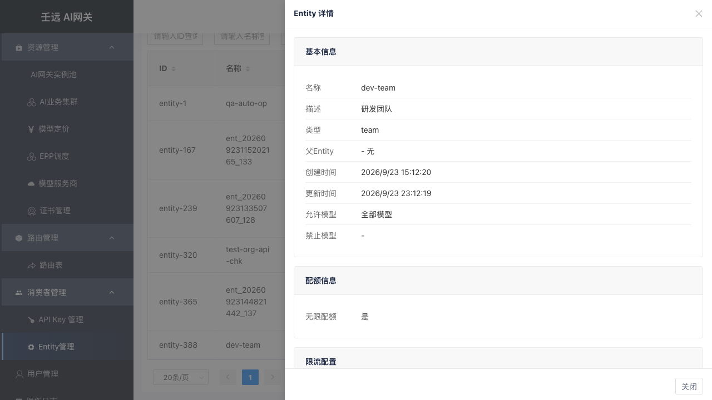
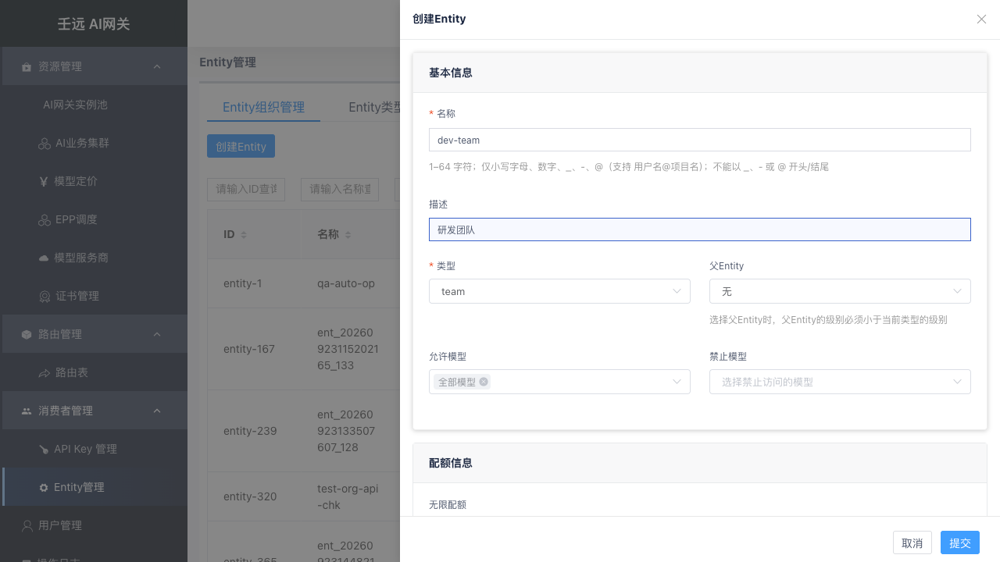
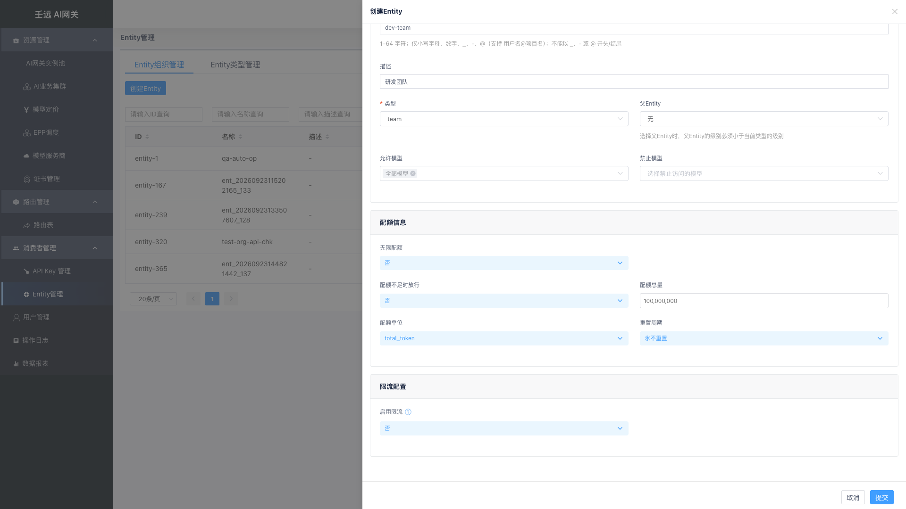

# 08 消费者管理：Entity 组织

**Entity 组织**是调用方的分组抽象（公司 / 部门 / 团队 / 个人）。简单说，就是你要把调用方按什么维度分组管理——可以按部门、按团队、甚至按个人。API Key 可挂载到某个 Entity 组织，继承其治理策略。

进入 消费者管理 → Entity 管理（组织管理），默认进入 **Entity 组织管理** 页签。

## 9.1 组织列表

**表格列说明**：

| 列名 | 说明 |
| --- | --- |
| ID | 组织唯一标识 |
| 名称 | 组织名称，支持搜索和排序 |
| 描述 | 组织说明，支持搜索和排序；未填写时显示 `-` |
| 类型 | 所属 Entity 类型，支持搜索 |
| 父Entity | 父组织名称，无父级时显示 `-` |
| 配额 | 有限配额时显示 `已用 / 总量`，后接单位（`tokens` 或 `RMB`）；无限配额时显示 `-` |
| 限流状态 | 已启用 / 未启用，支持下拉筛选 |
| 操作 | 管理路由规则、编辑、删除 |

点击列表中任意一行可查看组织详情。列表上方有「创建Entity」按钮（右上角）。

### 查看详情

点击组织行，右侧弹出详情抽屉，以只读方式展示组织全部配置：

- **基本信息**：名称、描述、类型、父Entity、创建时间、更新时间、允许模型、禁止模型
- **配额信息**：配额类型（无限/有限）、配额总量、已使用、剩余量、使用进度条、重置周期。`total_token` 模式下显示 `xxx tokens`，`RMB` 模式下显示 `¥xxx`（保留 4 位小数）。有限配额时可点击「重置配额」按钮重置。
- **限流配置**：限流状态、最大并发、TPM 规则列表、RPM 规则列表

### 重置配额

在详情抽屉的配额信息区域，有限配额时显示「重置配额」按钮。点击后弹出重置弹窗：

| 字段 | 必填 | 说明 |
| --- | --- | --- |
| 新的配额总量 | 是 | 非负数；`total_token` 模式下为整数，取值范围 0 ~ 9,999,999,999；`RMB` 模式下取值范围 0 ~ 90,000,000.00，最多保留 4 位小数 |
| 重置原因 | 否 | 选填，记录重置原因 |

> 重置后已使用量归零，配额总量更新为新设置的值。

## 9.2 创建组织

点击列表上方的「创建Entity」按钮，右侧弹出创建抽屉。表单分为三个区域：基本信息、配额信息、限流配置。

### 基本信息

| 字段 | 必填 | 默认值 | 格式要求 | 说明 |
| --- | --- | --- | --- | --- |
| 名称 | 是 | 空 | 1-64 字符；仅小写字母、数字、`_`、`-`、`@`（支持 `用户名@项目名`）；不能以 `_`、`-`、`@` 开头或结尾；不能包含前导或尾随空格；不能包含控制字符 | 全局唯一，创建后不可修改 |
| 描述 | 否 | 空 | 最多 255 字符；不能包含控制字符 | 组织说明，可留空；表单中无必填星号，也无提示小字 |
| 类型 | 是 | 空 | — | 下拉选择，选项来自 Entity 类型管理。创建后不可修改 |
| 父Entity | 否 | 无 | 父 Entity 的类型级别必须小于当前类型的级别 | 下拉选择，可筛选。选择后当前组织成为其子组织 |
| 允许模型 | 否 | `*`（全部模型） | — | 允许访问的模型列表。选 `*` 表示**允许所有模型**（最宽松）；选具体模型表示**只允许这些模型**（更严格）。二者只能二选一：选了 `*` 就不能再选具体模型；选了具体模型，`*` 自动取消 |
| 禁止模型 | 否 | 空 | — | 禁止访问的模型列表，命中即拒绝，优先级高于允许模型 |

> 提示：父Entity 的级别必须小于当前类型的级别（数字更小）。例如当前类型级别为 3，则只能选择级别为 1 或 2 的组织作为父级。

### 配额信息

| 字段 | 必填 | 默认值 | 说明 |
| --- | --- | --- | --- |
| 无限配额 | — | 是 | 选「否」后展开以下字段 |
| 配额不足时放行 | 否 | 否 | 选"是"时，即使配额用完，请求仍然会被放行（不会被拒绝），但系统会继续统计用量。适合"先观察实际消耗、暂不拦截"的试运行阶段。选"否"时，配额用完则直接拒绝请求（返回配额不足错误） |
| 配额单位 | — | `total_token` | 可选 `total_token`（按 Token 计数）或 `RMB`（按金额计费） |
| 配额总量 | 是 | `100000000` | 非负数；`total_token` 模式下必须为整数，取值范围 0 ~ 9,999,999,999；`RMB` 模式下取值范围 0 ~ 90,000,000.00，最多保留 4 位小数 |
| 重置周期 | — | 永不重置 | 永不重置 / 每周 / 每月 |

### 限流配置

| 字段 | 必填 | 默认值 | 说明 |
| --- | --- | --- | --- |
| 启用限流 | — | 否 | 选「是」后展开以下规则区域 |

启用限流后，可配置 TPM 规则、RPM 规则和最大并发，需至少配置一项有效规则。

> **注意**：TPM/RPM 规则的「适用模型」按**转发后的目标模型**匹配——即经路由「指定模型」覆盖、集群「裁剪前缀」、集群「模型重定向」依次解析后的最终模型名（与后端实际收到的模型一致），而非请求体原始模型名。仅当未启用上述机制时，填客户端请求模型名才与旧行为等价；启用重定向/裁剪/目标覆盖后，须填转发后的模型名。

| 类型 | 适用场景 |
| ------ | ---------- |
| TPM | 控制 Token 消耗（长文本、推理成本高的场景） |
| RPM | 控制请求次数（防刷接口、限制 QPS） |
| 最大并发 | 控制同时处理的请求数（防止压垮后端） |

#### TPM 规则

**TPM（每分钟 Token 数）限流**：采用滑动窗口机制，平滑统计一段时间内的 Token 用量。每项最多 3 条规则。

**通俗理解**：

- **时间窗口**：你看多久范围内的用量。比如窗口 10 分钟，就是看过去 10 分钟用了多少 Token。
- **滑动步长**：统计窗口多久向前"滑"一次。比如步长 1 分钟，就是每分钟重新计算一次过去 10 分钟的总量。
- **最大 Token 数**：这个时间窗口内允许的 Token 上限。超过就限流（返回 429）。

**举例**：时间窗口 = 10 分钟，滑动步长 = 1 分钟，最大 Token 数 = 10000。表示"检查过去 10 分钟内的 Token 用量，每 1 分钟检查一次，超过 10000 就拒绝"。

> **建议**：如无特殊需求，保持默认值即可（窗口 1 分钟，步长 1 分钟）。

| 字段 | 必填 | 默认值 | 格式要求 | 说明 |
| --- | --- | --- | --- | --- |
| 规则名称 | 是 | 空 | 1-128 字符；同类型内不能重复 | 规则标识 |
| 适用模型 | 是 | `*`（全部模型） | — | `*` 或指定模型；按**转发后的目标模型**匹配 |
| 时间窗口(分) | 是 | `1` | 1-360 的整数 | 统计的时间范围 |
| 最大Token数 | 是 | `10000` | 非负整数 | 窗口内允许的最大 Token 数 |
| 滑动步长(分) | 是 | `1` | 1-360 的整数；不超过时间窗口 | 滑动窗口的步长 |

#### RPM 规则

RPM（Request Per Minute）采用**固定窗口**机制，以时间窗口为周期计数。每项最多 3 条规则。

| 字段 | 必填 | 默认值 | 格式要求 | 说明 |
| --- | --- | --- | --- | --- |
| 规则名称 | 是 | 空 | 1-128 字符；同类型内不能重复 | 规则标识 |
| 适用模型 | 是 | `*`（全部模型） | — | `*` 或指定模型；按**转发后的目标模型**匹配 |
| 时间窗口(分) | 是 | `1` | 1-360 的整数 | 统计的时间范围 |
| 最大请求数 | 是 | `100` | 非负整数 | 窗口内允许的最大请求数 |

> 注意：RPM 规则没有滑动步长字段，与 TPM 的区别在此。

#### 最大并发

| 模式 | 说明 |
| --- | --- |
| 不限制 | 不限制并发数（值为 -1），单独使用不会触发限流 |
| 封禁 | 禁止所有并发请求（值为 0） |
| 限制并发数 | 限制最大并发数，需填写具体数值（正整数） |

> **说明**：最大并发是"辅助选项"。
>
> - 如果你想**只做请求速率控制**（如每分钟 100 次），选"不限制"并发，只配 RPM 规则即可。
> - 如果你想**同时控制并发数**（如最多 10 个请求同时处理），选"限制并发数"并配合 TPM/RPM 使用。
> - "封禁"（0）是一个快捷选项，用于紧急停止所有请求。
>
> 因此"不限制"不是"无效"，而是表示"不限并发，让 TPM/RPM 单独发挥作用"。

## 9.3 编辑组织

点击操作列的「编辑」按钮，右侧弹出编辑抽屉。字段预填充，其中名称和类型为灰色禁用状态不可修改，其余字段均可编辑。

> 描述为非必填：留空提交不影响其他字段；清空已有描述后保存，会显式提交空字符串，描述被清空。

## 9.4 删除组织

点击操作列的「删除」按钮，弹出确认框「是否删除Entity {名称}？」。确认后立即删除，提示「删除成功!」，列表自动刷新。

> 注意：组织存在子组织或被 API-Key 挂载时无法删除，需先清理关联数据。

## 9.5 模型访问控制

组织可配置允许模型和禁止模型列表，控制挂载到该组织的 API-Key 能访问哪些模型。

- **允许模型**：允许列表，`*` 表示全部模型；多层组织运行时取交集。
- **禁止模型**：禁止列表，命中即 403，优先级高于允许列表。

请求模型不在允许列表或在禁止列表时，数据面直接返回 403，不转发后端。

## 9.6 运行时生效机制

请求进入网关后，按固定顺序执行三道检查：**模型访问控制 → 限流检查 → 配额扣减**，任一环节失败立即拒绝。

**模型访问控制**

1. 先检查 API-Key 自身的「允许模型」：不含 `*` 且请求模型不在列表 → 拒绝。
2. 若 Key 挂载了组织，从该组织开始向上遍历全部祖先（含自身），逐个检查：
   - 禁止模型优先：命中 `*` 或请求模型 → 拒绝。
   - 允许模型取交集：任一层的允许列表不含请求模型 → 拒绝。

**限流检查**

- 收集 Key 自身 + 挂载组织 + 全部祖先组织中所有「启用限流」的策略，全部通过才放行；任一策略触发即限流。TPM/RPM 规则的「适用模型」按**转发后的目标模型**匹配（解析链路与模型访问控制一致），而非请求体原始模型名。

**配额扣减**

- 收集 Key 自身 + 组织链上所有「有限配额」的计划，逐一扣减；任一计划余额不足且未开启「配额不足时放行」→ 拒绝，且已扣减部分原子回滚。
- 「配额不足时放行 = 是」时，余额扣到 0 仍放行本次请求。

## 9.7 管理路由规则

点击操作列的「管理路由规则」按钮，跳转到路由规则页面，自动筛选出属主为该组织的路由规则。详见 [10 章](10-route.md)。

## 9.8 注意事项

- 组织名称和类型创建后不可修改。
- 父 Entity 的类型级别必须小于当前类型的级别。
- 配额与限流可同时配置：配额控制总量成本，限流控制瞬时并发。
- 修改组织策略实时生效，影响挂载到该组织及其后代的全部 Key，请在低峰期操作。
- 删除组织前需确保不存在子组织和被 API-Key 挂载。
- 路由表优先级 API-Key > Entity > Global。
