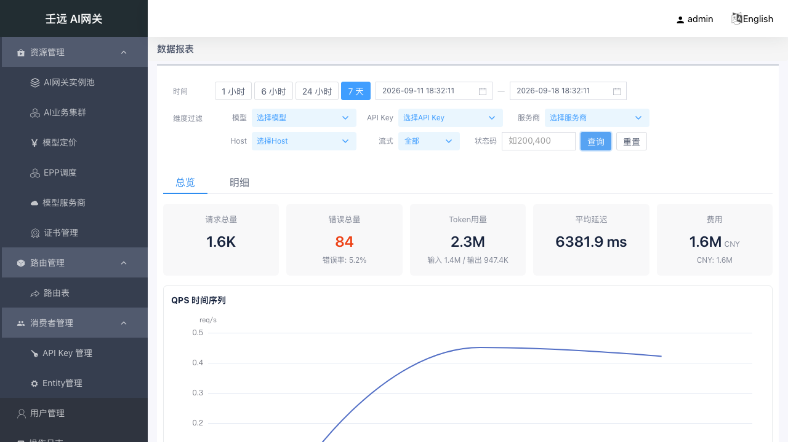
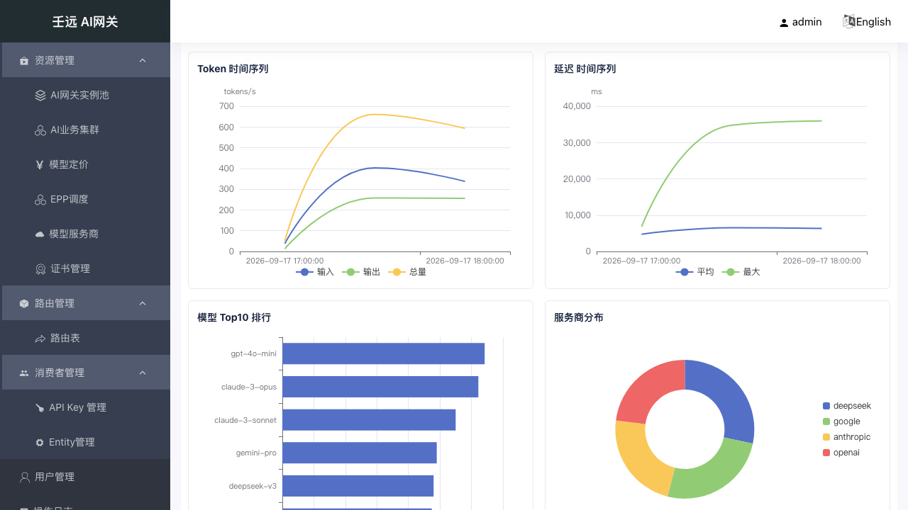
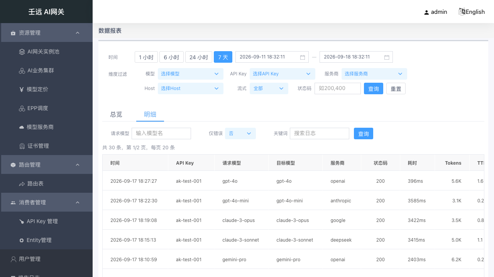
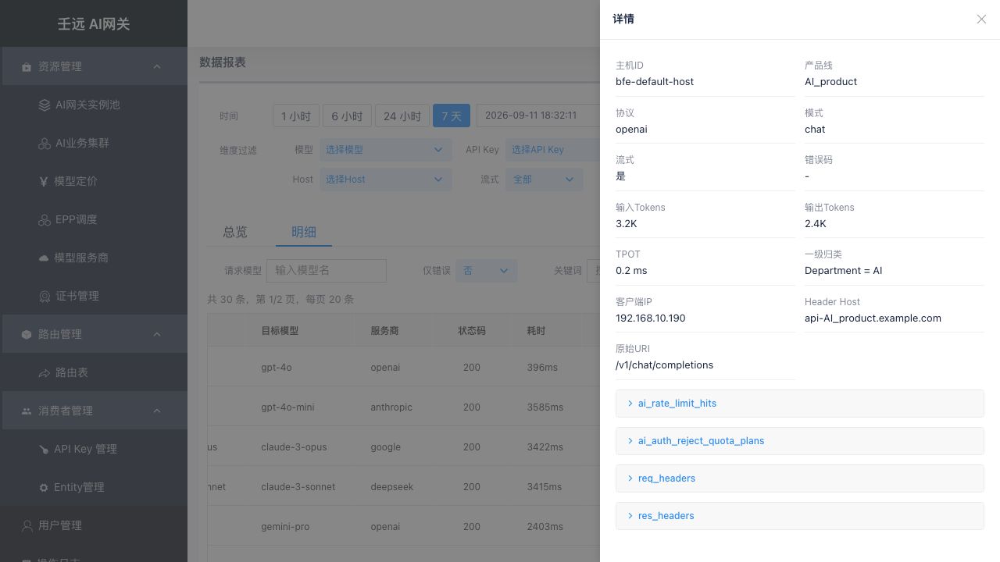

# 12 数据报表

数据报表提供网关运营数据的**可视化查询与分析**，包括总览指标卡、时序折线图、维度排行、占比分布与日志明细。数据后端支持 MySQL（轻量形态）与 Doris（标准形态），同一套界面两种后端结构一致。

**入口**：侧栏「数据报表」（路径 `/report`）。

## 12.1 页面结构

页面分为**全局过滤栏**和**页签区域**两部分：

- **过滤栏**：顶部全局过滤条件，切换页签后条件保持，点击「查询」重载当前页签数据
- **页签**：**总览** + **明细**（2 页签切换）

全局过滤栏提供时间范围、路由模型、API Key、提供商、主机、流式、状态码等过滤参数（均可选、可组合），并内置快捷时间按钮（1 小时 / 6 小时 / 24 小时 / 7 天）。点击「查询」读取所有过滤参数并重新请求当前页签数据；「重置」恢复全部过滤参数为默认值。

## 12.2 总览页签

总览页签展示选定时间窗口内的**5 项指标卡**与 **6 张 echarts 图表**（2 行 × 3 列网格布局）。

> 延迟分位数仅 Doris 后端返回；MySQL 后端无原生分位数。

图表响应窗口缩放，切换页签时自动销毁重建。

## 12.3 明细页签

明细页签展示**服务端分页的日志表格**，支持行展开查看完整字段与 JSON 数据。

明细页签内另有独立过滤条件（请求模型、只看错误、错误消息关键字），仅影响日志表格查询。

日志表格采用**服务端分页**，默认每页 **20** 条（最大 100 条）。底部分页栏显示「共 X 条，第 Y/Z 页」，支持上一页 / 下一页翻页。

## 12.4 注意事项

- 时间窗口上限为 **7 天**；超过 7 天的范围请在过滤栏分段查询
- 时序数据的采样间隔由服务端按窗口自动计算，客户端无需传参
- 成本数据按币种分开展示：总览卡主值取首个币种（金额 + 币种小字），其余币种以副行列示；无成本数据时成本卡显示「-」
- 明细日志按时间倒序排列，确保最新的请求优先展示
- MySQL 后端无延迟分位数，总览卡中这些指标不展示。如有分位数需求，建议升级到 Doris 后端
